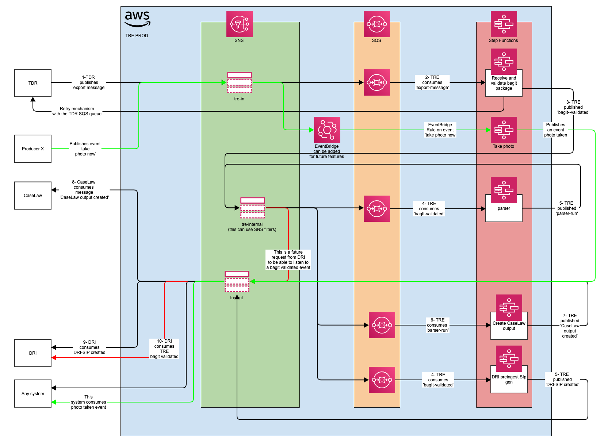

# New messaging architecture

Date: 28-07-2022

## Status

Proposed

## Context

The new [Enhanced message structure](./001-Enhanced-message-structure.md) requires a new architecture on messaging exchange between TRE and other systems.

The new architecture has to follow the Event-driven approach, with 
- event producers, 
- event consumers.

> Phil, can you add more details in this section about the future plan?

## Options considered

See document [New messaging architecture](../technology-considerations/messaging-architecture/README.md) in the [technology considerations](../technology-considerations/) folder.

## Decision

The following is now proposed as the new messaging architecture:

TRE will have two SNS topics:

- **tre-in** where external systems/services can subscribe and become producers in order to send messages to TRE
- **tre-out** where external systems/services can subsribe and become consumers in order to consume messages from TRE

The topics will not define any SNS rules to filter the messages: the consumers are responsable of filtering the messages, accepting or rejecting them based on their implementation.

There will be an additional SNS topic called **tre-internal** which is dedicated to internal routing, this topic can filter messages and trigger specific AWS step functions.

For more details about the integrations between TRE and other systems have a look at the following pages:

- [New TDR-TRE integration](./003-New-TDR-TRE-integration.md)
- [New CaseLaw-TRE integration](./004-New-CaseLaw-TRE-integration.md)
- [Parser separation](./005-Parser-separation.md)

## Consequences

With this architecture any integration with TRE is much more simpler, any new service can be a producer and/or a consumer by subscribing to the two topics **tre-in** and **tre-out**. 

A monitoring tool system can easly consumes messages from **tre-out** topic.

> What becomes easier or more difficult to do because of this change?
> Phil, anything else to add?
