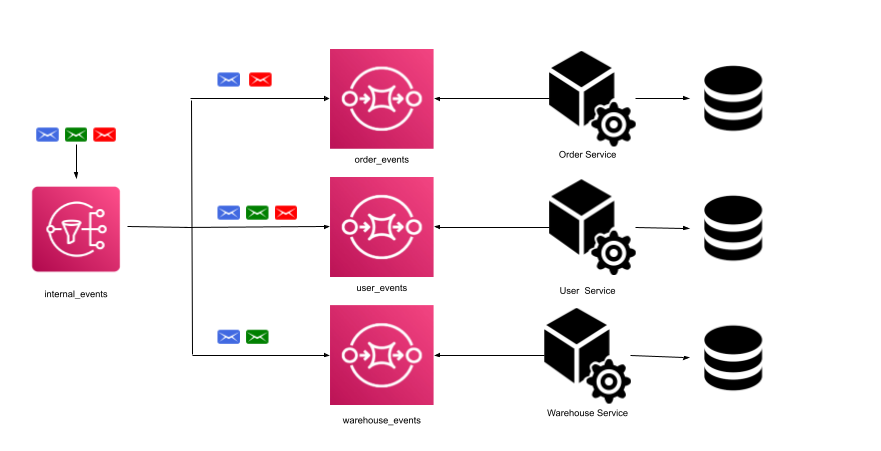
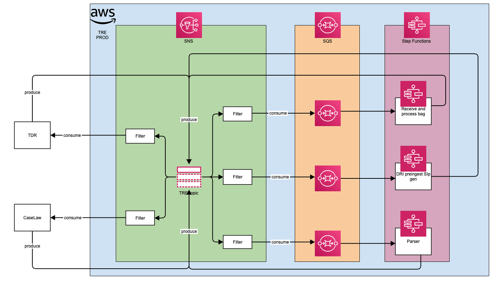

# New messaging architecture

## Table of Contents
- [AWS fan-out pattern](#aws-fan-out-pattern)
    - [SNS](#sns)
    - [SQS](#sqs)
    - [SNS-SQS fan-out](#sns-sqs-fan-out)
- [Event-Driven Architecture](#event-driven-architecture)
- [Option-1 - Single SNS topic and multiple SQS queue with fan-out](#option-1---single-sns-topic-and-multiple-sqs-queue-with-fan-out)
- [Option-2 - Single SNS topic with AWS EventBridge](#option-2---single-sns-topic-with-aws-eventbridge)
- [Option-3 - Multiple SNS topics and SQS queues with fan-out](#option-3---multiple-sns-topics-and-sqs-queues-with-fan-out)
- [References](#references)

## AWS fan-out pattern

### SNS
AWS SNS is a publisher-subscriber network, where subscribers can subscribe to topics and will receive messages whenever a publisher publishes a message on that topic.

### SQS
AWS SQS is a queue service, which stores messages in a queue. SQS cannot deliver any messages, an external service needs to poll SQS and grab the messages from the queue.

By coupling SNS with SQS, you can receive messages at your pace. It allows clients to be offline, and tolerant of network and host failures. You also achieve guaranteed delivery and you can have multiple consumers processing the same message.
A dead-letter queue is a queue that one or more source queues can use for messages that are not consumed successfully. For more information, see Amazon SQS dead-letter queues.

### SNS-SQS fan-out

The fan-out is a messaging pattern that implies the delivery of a message to one or multiple consumers in parallel.

By using this pattern, you can build applications that take advantage of parallel, asynchronous processing. This is extremely useful if your downstream services can work independently.

In AWS, we can use it to replicate an event to one or more SQS queues using SNS. A new feature is that you can now use FIFO topics, in combination with FIFO queues to build applications that require messages to be sent and processed in a strict sequence and without duplicates.

## Event-Driven Architecture 

An event-driven architecture uses events to trigger and communicate between decoupled services and is common in modern applications built with microservices. 
An event is a change in state that tells you information about something that happened in your application. In event-driven architecture, each component of the application raises an event whenever anything changes. Other components listen and decide what to do with it and how they would like to react.

Event-driven architectures have three key components: 
- event producers, 
- event routers, 
- event consumers. 
A producer publishes an event to the router, which filters and pushes the events to consumers. Producer services and consumer services are decoupled, which allows them to be scaled, updated, and deployed independently.

## Option-1 - Single SNS topic and multiple SQS queue with fan-out

TO DO

## Option-2 - Single SNS topic with AWS EventBridge 

### AWS EventBridge

EventBridge simplifies the process of building event-driven architectures. 
EventBridge connects applications using events. An event is a signal that a system’s state has changed, such as a change in the status of a customer support ticket. Customers can integrate their own AWS applications with microservices, SaaS applications, and custom applications as event sources that publish events to an event bus. You can define a filtering rule to filter events and route events to AWS service targets and API destinations (via HTTP endpoints). EventBridge schema registry stores schema generated by your organization’s applications, AWS services, or SaaS applications. A schema includes information such as the title, format and validation rules for event data. You can download code bindings for any schema in the registry in your IDE and directly use the strongly-typed object representing the event in your code.

TO DO

## Option-3 - Multiple SNS topics and SQS queues with fan-out

TO DO

## References

- https://aws.amazon.com/event-driven-architecture/
- https://aws.amazon.com/eventbridge/
- https://medium.com/aws-in-plain-english/event-driven-architecture-implement-the-fan-out-messaging-pattern-in-aws-using-terraform-f58234d9e208
- https://aws.amazon.com/blogs/compute/building-an-event-driven-application-with-amazon-eventbridge/
- https://docs.aws.amazon.com/sns/latest/dg/sns-message-attributes.html
- 
